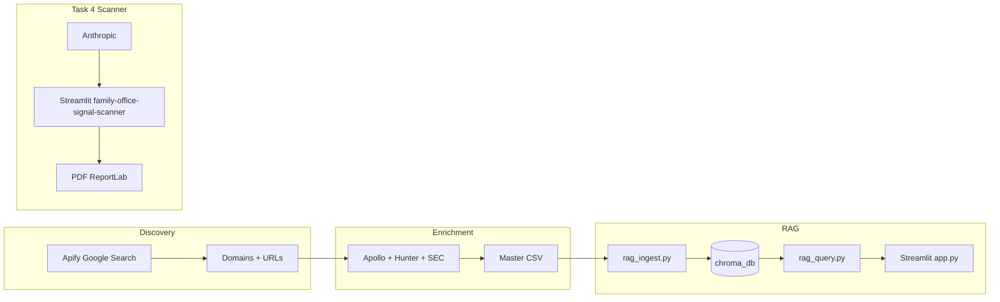

# Family Office Intelligence Platform

## A production-grade family office data pipeline, RAG intelligence system, and AI-powered scanner

### Falcon / PolarityIQ evaluation mapping

| Falcon task | Requirement (summary) | Location in repo |
|-------------|-------------------------|------------------|
| **Task 1** | ≥200 real FO records, CSV/XLSX, documentation | `output/`, `docs/DATASET_DOCUMENTATION.md`, `docs/DATA_DICTIONARY.md` |
| **Task 2** | RAG on Task 1 data, vector DB, live or recorded demo | `rag_ingest.py`, `rag_query.py`, `app.py`, `chroma_db/`, §11 in dataset doc |
| **Task 3** | SaaS conversion analysis (PolarityIQ) | Your deliverable in `docs/` (you already have this) |
| **Task 4** | Trip-wire product ($47–$1k), build + explanation | `family-office-signal-scanner/`, `docs/TASK4_BUILD_WALKTHROUGH.md` |

## Live demos (paste your Streamlit Cloud URLs here)

- **FO Intelligence RAG:** `[YOUR_STREAMLIT_RAG_URL]`
- **Family Office Signal Scanner:** `https://family-office-signal-scanner-ikpxhsqs7lcqpu2cuy9m8n.streamlit.app/` (change if you redeploy)

Deploy **two** Streamlit Cloud apps from the **same** GitHub repo with **different** entrypoints (see below).

---

## Evaluator quickstart (~60 seconds)

1. Open **`output/family_office_intelligence_master.csv`** — confirm ≥200 rows of real FO data.
2. Open the **RAG** Cloud URL — sidebar should show indexed count (~220). Run a query, e.g. *Which family offices focus on venture capital?*
3. Open the **Signal Scanner** Cloud URL — run a scan with a valid **`ANTHROPIC_API_KEY`** in Secrets.
4. Skim **`docs/DATASET_DOCUMENTATION.md`** (methodology + Task 2 RAG section) and **`CHANGELOG.md`**.

---

## Architecture



---

## Dataset stats (reference)

- **220** validated family office records (master output)
- **13** countries covered
- **38** verified emails (within free-tier Hunter constraints during build)
- Honest limits on tiers: **`docs/DATASET_DOCUMENTATION.md`** §8

---

## Tech stack

- **Python 3.11** (`runtime.txt` for Streamlit Cloud)
- **pandas**, **openpyxl**
- **Apify**, **Apollo.io**, **Hunter.io**, **SEC EDGAR**
- **ChromaDB**, **OpenAI** `text-embedding-3-small`, **sentence-transformers** fallback (`all-MiniLM-L6-v2`)
- **Anthropic** (RAG answers + Signal Scanner), **Streamlit**
- **ReportLab** (Scanner PDF)

---

## Setup (local)

```powershell
cd family-office-intelligence
python -m venv venv
.\venv\Scripts\activate
pip install -r requirements.txt
copy .env.example .env
# Edit .env with your keys (never commit .env)
```

### Index the dataset for RAG (optional if using committed `chroma_db/`)

If `OPENAI_API_KEY` is missing or invalid, ingestion uses **`sentence-transformers/all-MiniLM-L6-v2`**. **`rag_query.py` reads `docs/rag_ingestion_log.json`** so query vectors always match the index.

```powershell
python rag_ingest.py
```

### Run FO Intelligence (RAG) — repo root

```powershell
streamlit run app.py
```

### Run Family Office Signal Scanner (separate process)

```powershell
streamlit run family-office-signal-scanner/app.py
```

### Smoke test (CI runs this too)

```powershell
python scripts/smoke_rag.py
```

---

## Two Streamlit apps (Streamlit Cloud)

| App | Main file | Requirements | Secrets (typical) |
|-----|-----------|--------------|-------------------|
| **RAG** | `app.py` | Root **`requirements.txt`** | `ANTHROPIC_API_KEY` (answers), optional `OPENAI_API_KEY` (ignored for embeddings if log says local index) |
| **Scanner** | `family-office-signal-scanner/app.py` | Advanced: **`family-office-signal-scanner/requirements.txt`** | `ANTHROPIC_API_KEY`, optional `ANTHROPIC_MODEL` |

**RAG index:** This repo **includes** a built **`chroma_db/`** so Cloud does not require running ingest on the server. **`docs/rag_ingestion_log.json`** records whether the index used OpenAI or local embeddings; **`rag_query.py`** enforces parity. To rebuild: run `rag_ingest.py`, commit `chroma_db/` + `docs/rag_ingestion_log.json`, redeploy.

**Advanced:** `RAG_IGNORE_INGESTION_LOG=1` restores key-only embedding selection (debug only).

---

## CI

GitHub Actions runs **`python scripts/smoke_rag.py`** on push/PR to **`main`** / **`master`**.

---

## Documentation

| Doc | Purpose |
|-----|---------|
| `docs/FALCON_SUBMISSION_PLAYBOOK.md` | Official brief alignment, checklists |
| `docs/DATASET_DOCUMENTATION.md` | Methodology, Task 2 RAG §11 |
| `docs/DATA_DICTIONARY.md` | Column meanings |
| `docs/TASK4_BUILD_WALKTHROUGH.md` | Task 4 stack, ICP, ascension |
| `docs/rag_ingestion_log.json` | Last ingest embedding mode + record count |
| `CHANGELOG.md` | Release-style change log |

---

## Push & clone

```powershell
git clone https://github.com/danishah17/family-office-signal-scanner.git
cd family-office-signal-scanner
```

*Use your actual `origin` if different.*

---

## License / usage

Internal / demonstration use unless otherwise specified. Do not commit `.env` or API keys.
